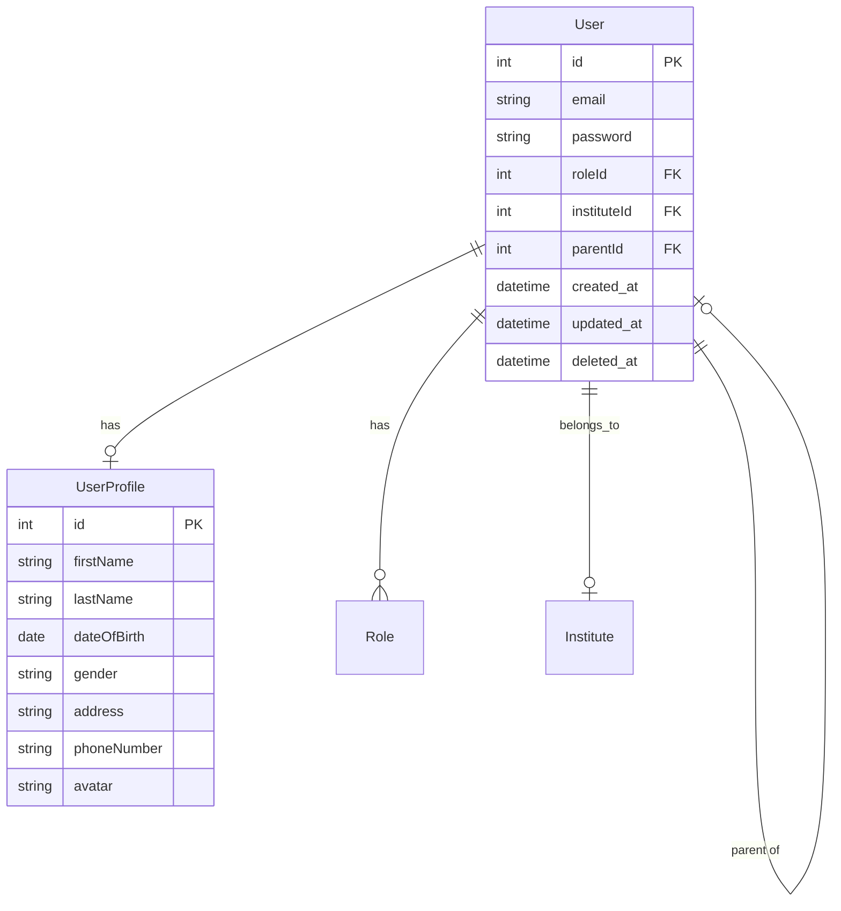
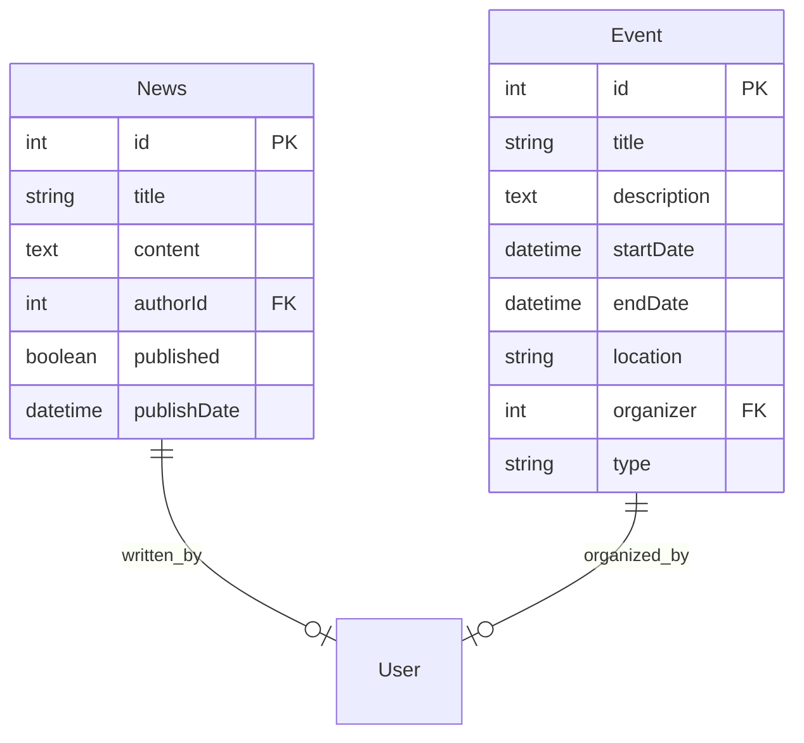
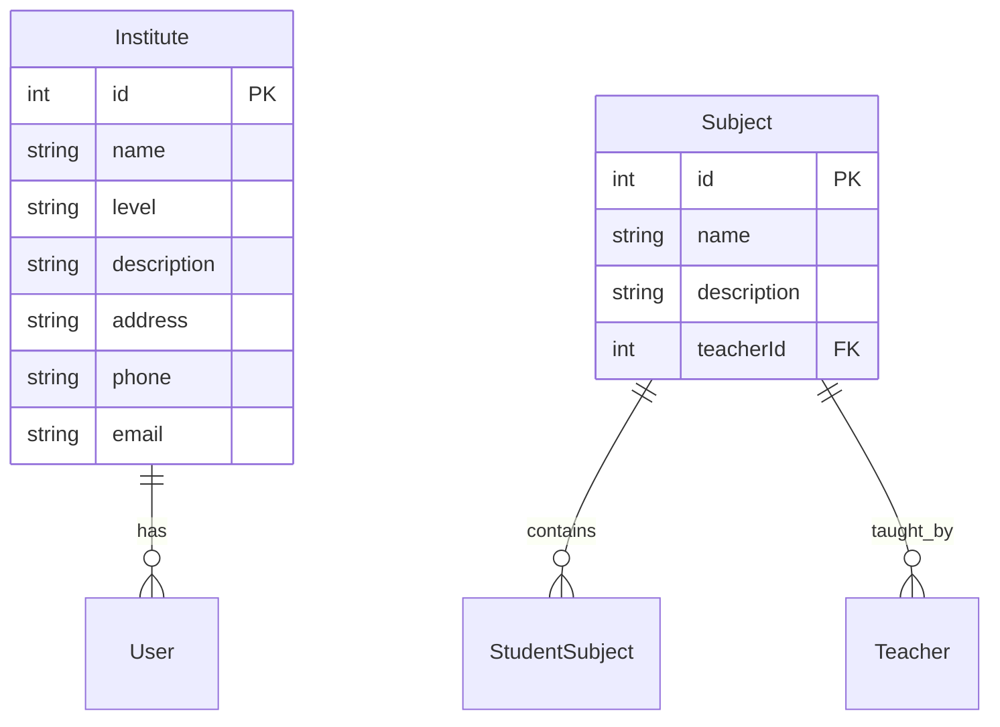

# Sistema de Gestión Escolar

Este sistema está diseñado para gestionar todos los aspectos de una institución educativa, desde la administración académica hasta la gestión financiera.

## Estructura de la Base de Datos

### Módulo de Usuarios y Perfiles

- users: Almacena la información básica de autenticación
- user_profiles: Contiene información detallada del perfil de usuario
- roles: Define los roles del sistema (ADMIN, TEACHER, STUDENT, PARENT)

### Módulo de Noticias

## noticias de la escuela: 

education_levels: Define los niveles de educación (jardín, primaria, secundaria).
news: Almacena noticias, con opción de ser privadas y asociadas a un nivel educativo.
events: Almacena eventos, con opción de ser privados y asociados a un nivel educativo.
users: Contiene información de los usuarios registrados, incluyendo su rol (alumno, padre, docente, administrador) y nivel educativo.
notifications: Permite enviar notificaciones personalizadas a usuarios específicos, cursos o toda la institución.
courses: Define los cursos disponibles en cada nivel educativo.
course_enrollments: Registra la inscripción de usuarios en cursos específicos.

## módulo de calificaciones:

subjects: Define las materias disponibles en cada nivel educativo.
teacher_subjects: Relaciona a los docentes con las materias que dictan.
student_subjects: Relaciona a los estudiantes con las materias que cursan.
evaluation_periods: Define los periodos de evaluación (mes, bimestre, trimestre, etc.).
evaluations: Almacena las evaluaciones realizadas por los docentes en cada materia y periodo.
grades: Registra las calificaciones de cada estudiante en las evaluaciones.
attendance: Registra las asistencias de los estudiantes.
conduct: Permite a los docentes registrar la conducta y observaciones de los estudiantes durante un periodo.

## módulo de cuentas corrientes para los estudiantes:

fees: Registra las cuotas de los estudiantes, incluyendo el monto, la fecha de vencimiento, y si han sido pagadas.
exam_permits: Almacena los permisos de examen para los estudiantes, indicando la materia, la fecha del permiso, y si ha sido utilizado.
study_materials: Registra la compra de materiales de estudio por parte de los estudiantes, incluyendo el nombre del material, la fecha de compra, y si ha sido recibido.

## módulo para la gestión de postulaciones y registros de docentes:

job_applications: Permite a los docentes interesados postularse para trabajar en la institución, incluyendo su nombre, información de contacto, materias que pueden dictar y su currículum.
teacher_records: Almacena el legajo de los docentes activos, incluyendo información personal y su historial laboral.
payrolls: Registra los recibos de sueldo de los docentes, incluyendo la fecha de pago, el monto y detalles adicionales.
replacements: Almacena el historial de reemplazos de los docentes, indicando la materia y las fechas de inicio y fin.
teacher_absences: Registra las ausencias de los docentes, incluyendo la fecha y el motivo.
teacher_positions: Almacena los cargos que los docentes tienen o han tenido en la institución, con las fechas de inicio y fin.

## módulo de exámenes:

exam_sessions: Define los periodos de examen, indicando el nombre y las fechas de inicio y fin.
exams: Almacena los exámenes programados, incluyendo la materia, el periodo de examen y la fecha del examen.
exam_records: Registra las actas de exámenes, incluyendo las notas escritas, orales y finales de cada estudiante evaluado.

## módulo de gestión de familias:

families: Define las familias, permitiendo agrupar a los miembros bajo un nombre familiar.
family_members: Relaciona a los usuarios con sus familias, especificando su rol (padre o estudiante).
users: Se ha añadido una columna family_id para asociar a cada usuario con una familia.

